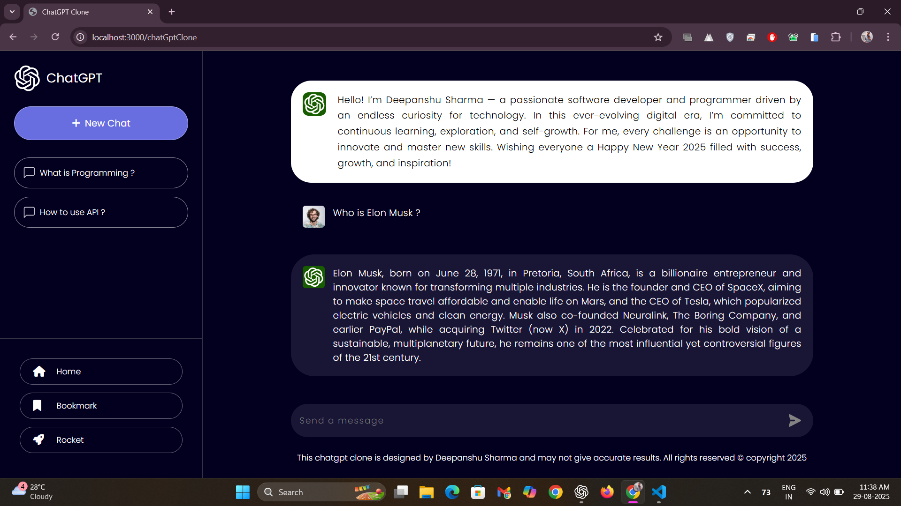
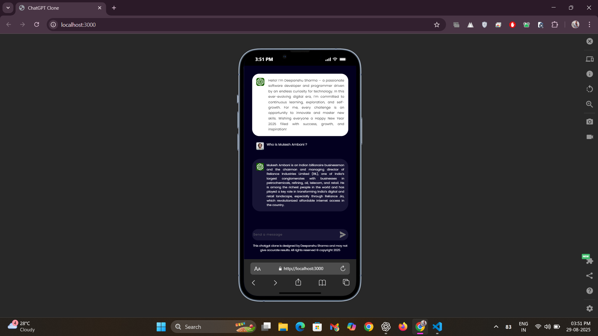

# 🚀 ChatGPT Clone

[](https://reactjs.org/) 
[](https://developer.mozilla.org/en-US/docs/Web/JavaScript)
[](https://tailwindcss.com/)
[](https://openai.com/)
[](https://socket.io/)
[](LICENSE)

**A high-performance, real-time AI chatbot built with cutting-edge technologies including React.js, JavaScript, Tailwind CSS, Socket.io, and OpenAI GPT-4.0-mini API.**

---

## 🌟 Overview
This project is a ChatGPT clone that simulates a virtual therapist bot. Users can have real-time, context-aware conversations powered by OpenAI GPT-4.0-mini API. The app improves user engagement through interactive and meaningful responses.

---

## 🌐 Live Demo
Try the ChatGPT Clone online: [Chat with me](https://chatgpt-clone-online.netlify.app/)

---

## ⚡ Features
- **Real-time intelligent conversation:** Engage & Chat with a smart AI providing context-aware, dynamic responses.
- **React.js with Hooks:** Advanced state management for scalable and maintainable frontend architecture.  
- **Socket.io integration:** Enables fast, low-latency, bidirectional client-server communication.  
- **OpenAI GPT-4.0-mini API key:** Secure access to the state-of-the-art AI model powering intelligent responses.  
- **Axios for API requests:** Optimized asynchronous communication with robust error handling.  
- **Responsive UI powered by Tailwind CSS:** Clean, modern, and adaptive interface across devices.  

---

## ✅ Advantages
- **Enhanced user engagement** with highly interactive, context-aware AI interactions.  
- **High-performance backend communication** leveraging Socket.io and optimized API calls.  
- **Scalable and maintainable architecture** with modular React Hooks design patterns.  
- **Secure and reliable AI integration** via OpenAI GPT-4.0-mini API.  

---

## 🖼 Screenshots

### Home View
  
*ChatGPT Clone interface showcasing a sleek, responsive design built with React.js and Tailwind CSS.*

### Mobile View
  
*Responsive mobile layout providing seamless real-time AI interactions via Socket.io and OpenAI GPT-4.0-mini API.*

---

## 🛠 Installation

```bash
# Clone the repository
git clone <your-repo-link>

# Navigate to the project folder
cd ChatGPT-Clone

# Install dependencies
npm install

# Start the development server
npm start
